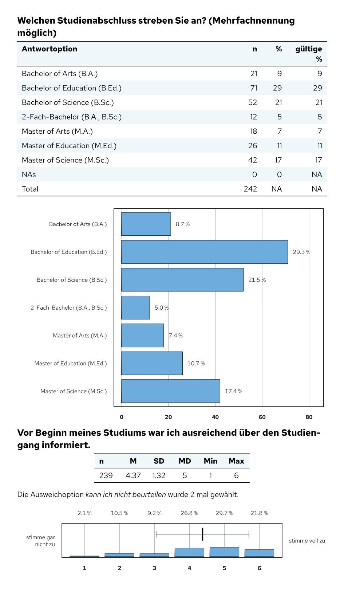

# setanalysis

**Deutsch** · [English](README.en.md) · [Website](https://donvollb.github.io/setanalysis/)

[](https://github.com/donvollb/setanalysis/actions/workflows/R-CMD-check.yaml)
[](LICENSE.md)

R-Paket für personalisierte Ergebnisberichte von Befragungen, insbesondere
Lehrveranstaltungsevaluationen sowie Befragungen von Studierenden und
Absolvent\*innen. Eine Zeile Code pro Frage erzeugt Überschrift, Tabelle und
Abbildung für einen [Quarto](https://quarto.org)-Bericht (PDF über Typst).
Über eine Berichts- und eine Regeltabelle entstehen aus einer einzigen
Vorlage viele Berichte mit unterschiedlichem Inhalt, z. B. für einzelne
Fachbereiche oder Studiengänge.

<p align="center">
  
  
</p>

## Funktionen

- **Daten aus evasys einlesen:** `evasys_read_data()` liest Rohdaten und
  Codebuch und hängt jeder Variable Fragetext, Fragenummer, Fragetyp und
  Antwortcodes als Attribute an.
- **Eine Funktion pro Fragetyp:** Single Choice, Multiple Choice, Skalen,
  mehrere Skalenfragen gemeinsam, Zahlen, Fachsemester, Noten, Workload,
  Rücklauf und offene Fragen – jeweils mit einheitlich gestalteten Tabellen
  und Grafiken. `merge_many()` wertet ganze Fragenblöcke auf einmal aus.
- **Viele Berichte aus einer Vorlage:** `input_tabelle()` berechnet aus einer
  Berichts- und einer Regeltabelle (Excel), welche Fragen in welchem Bericht
  erscheinen.
- **Offene Antworten im Anhang:** gleiche Antworten werden zusammengefasst,
  Links führen von der Frage in den Anhang und zurück.
- **Einheitliches Erscheinungsbild:** Akzentfarbe, Spaltenbreiten und
  Voreinstellungen zentral über `change_analysis_defaults()` einstellbar;
  die Schrift „Red Hat Text“ wird für die Grafiken mitgeliefert.

## Installation

```r
# install.packages("pak")
pak::pak("donvollb/setanalysis")
```

Für die Berichte werden außerdem [Quarto](https://quarto.org) (≥ 1.7,
enthält Typst) und die Schrift
[Red Hat Text](https://fonts.google.com/specimen/Red+Hat+Text) benötigt.

## Schnellstart

Die Auswertungsfunktionen schreiben Markdown bzw. Typst in die Ausgabe. Sie
stehen deshalb in R-Chunks mit `output: asis`:

````markdown
---
title: "Lehrveranstaltungsevaluation"
format: typst
---

```{r}
#| include: false
library(setanalysis)
daten <- BspDaten$dataLVE # eigene Daten: evasys_read_data("rohdaten.csv", "codebuch.csv")
```

```{r}
#| output: asis
merge_aggr_sk(daten[, c("KF_01", "KF_02", "KF_03")], kennung = daten$Kennung, aggr = TRUE)
merge_grade(daten$Note, daten$Kennung)
merge_sc(daten$V3_D)
```
````

In RStudio lässt sich eine einzelne Auswertung ohne Rendern als Vorschau
anzeigen: `markdown_in_viewer(merge_sc(BspDaten$dataLVE$V3_D))`.

## Typischer Ablauf

1. **Daten einlesen** mit `evasys_read_data()` (oder eigene Daten mit den
   Attributen `label`, `nr`, `type` und `labels` versehen).
2. **Berichte festlegen** (bei mehreren Berichten mit unterschiedlichem
   Inhalt): Berichtstabelle mit einer Zeile pro Bericht, Regeltabelle mit einer
   Bedingung pro Frage; `input_tabelle()` berechnet daraus die Schalter
   `inkl.<Abschnitt>.<Frage>` und `header<Abschnitt>`.
3. **Bericht schreiben** in Quarto: pro Frage eine Auswertungsfunktion, z. B.
   `merge_sc(x, nr = "1.3")`. Mit `nr` fragt die Funktion den Schalter
   `inkl.1.3` ab und erscheint nur in den passenden Berichten.
   `appendix_open()` am Ende gibt die gesammelten offenen Antworten aus.
4. **Alle Berichte erstellen**, z. B. mit `quarto::quarto_render()` in einer
   Schleife über die Zeilen der Berichtstabelle.

Eine ausführliche Anleitung mit allen Schritten steht in der Vignette
[Einen Evaluationsbericht erstellen](https://donvollb.github.io/setanalysis/articles/bericht-erstellen.html).
Alle Hilfeseiten gibt es in der
[Funktionsreferenz](https://donvollb.github.io/setanalysis/reference/), einen
Überblick in R mit `?setanalysis`.

Eine fertige Berichtsvorlage mit Layout (Kopf- und Fußzeile,
Inhaltsverzeichnis, Akzentfarbe) und zwei lauffähigen Beispielen ist
[set-template](https://github.com/donvollb/set-template).

## Funktionsüberblick

| Bereich | Funktionen |
|---|---|
| Auswertung je Frage | `merge_sc()`, `merge_mc()`, `merge_sk()`, `merge_aggr_sk()`, `merge_num()`, `merge_fachsem()`, `merge_grade()`, `merge_wl()`, `merge_rueck()`, `merge_subj()`, `merge_open()`, `appendix_open()` |
| Automatisch nach Fragetyp | `merge_auto()`, `merge_many()` |
| Daten aufbereiten | `evasys_read_data()`, `input_tabelle()`, `aggr_data()`, `label_test()` |
| Tabellen | `lv_table()`, `table_freq()`, `table_stat_single()`, `table_stat_multi()` |
| Grafiken | `barplot_freq()`, `barplot_scmc()`, `barplot_sk()`, `boxplot_aggr_sk()`, `boxplot_grade()`, `boxplot_rueck()`, `boxplot_wl()` |
| Legenden | `bsp_table_stat()`, `bsp_boxplot()`, `bsp_evasys_sk6()` |
| Werkzeuge | `change_analysis_defaults()`, `subchunkify()`, `markdown_in_viewer()` |

Die Namen aus Version 1.0.0 (z. B. `merge.sc()`, `table.freq()`) funktionieren
weiterhin, siehe `?setanalysis-deprecated`.

## Beispieldaten

`BspDaten` enthält fiktive, zufällig erzeugte Daten einer
Lehrveranstaltungsevaluation und einer Studieneingangsbefragung im Format von
`evasys_read_data()`. Beispiel-Dateien für `evasys_read_data()` und
`input_tabelle()` liegen in `system.file("extdata", package = "setanalysis")`.

## Entwicklung

Das Verhalten der Funktionen ist mit Snapshot-Tests (testthat) abgesichert,
die die erzeugten Berichtsbausteine einschließlich der Grafiken (SVG)
vergleichen. Die Skripte, mit denen Beispieldaten und Vorschaubilder erzeugt
werden, liegen in `data-raw/`. Änderungen stehen im [Changelog](https://donvollb.github.io/setanalysis/news/).
Wie das Paket weiterentwickelt wird (Branches, Tests, GitHub Actions, Releases), beschreibt der Artikel
[Das Paket pflegen](https://donvollb.github.io/setanalysis/articles/paket-pflegen.html).

## Autoren und Lizenz

Dominik Vollbracht und Simon Männle ·
[MIT License](LICENSE.md)
