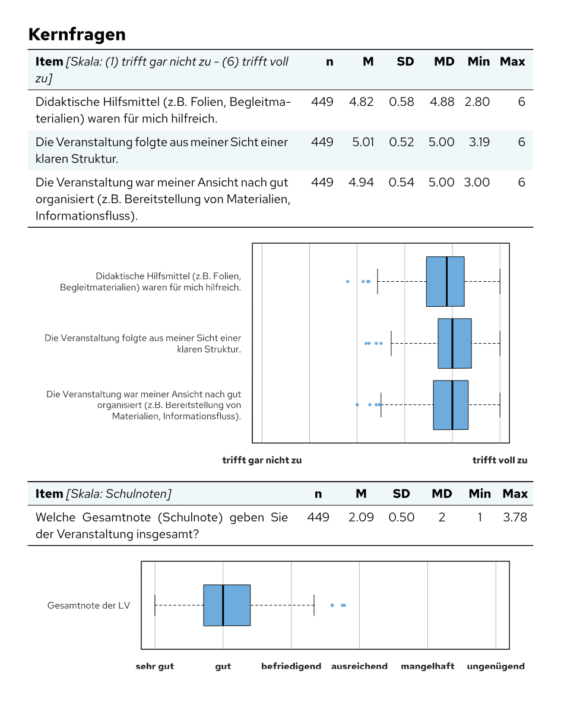

```{r, include = FALSE}
knitr::opts_chunk$set(collapse = TRUE, comment = "#>")
```

Diese Anleitung zeigt den Weg vom evasys-Export bis zu den fertigen
PDF-Berichten. Ein Auswertungsprojekt besteht aus drei Dateien, die
nacheinander und unterschiedlich oft ausgeführt werden:

| Datei | Wann? | Was passiert? |
|---|---|---|
| `vorbereitung.R` | einmal pro Befragung | Daten einlesen und bereinigen, festlegen, welche Fragen in welchen Bericht kommen, Schreibweisen prüfen, speichern |
| `bericht.qmd` | einmal pro Bericht | Daten laden, auf den Bericht einschränken, Fragen auswerten |
| `alle-berichte-rendern.R` | am Ende | `bericht.qmd` für jede Zeile der Berichtstabelle zu einem PDF rendern |

Die Vorlage [set-template](https://github.com/donvollb/set-template) enthält
genau diese drei Dateien als lauffähiges Beispiel (`beispiele/vorbereitung.R`,
`beispiele/kohorte.qmd`, `beispiele/alle-berichte-rendern.R`) und dazu das
Layout der Berichte.

**Nur ein einziger Bericht?** Dann entfallen Berichts- und Regeltabelle: Die
Daten werden direkt im Bericht eingelesen, und die Schritte 1.3, 1.4 sowie
die Abschnitte zu Schaltern und Filtern in Teil 2 fallen weg.

```{r setup}
library(setanalysis)
```


## 1. Vorbereitung (`vorbereitung.R`, einmal pro Befragung)

Die Vorbereitung läuft einmal, bevor der erste Bericht erstellt wird. Ihr
Ergebnis sind zwei Dateien: die aufbereiteten Daten und die Berichtstabelle.
Die Beispiele hier nutzen die fiktiven Dateien, die im Paket liegen.

### 1.1 Den evasys-Export einlesen

evasys exportiert die Antworten (Rohdaten) und ein Codebuch mit Fragetexten,
Fragetypen und Antwortoptionen, jeweils als CSV-Datei. `evasys_read_data()`
liest beide ein:

```{r}
rohdaten <- system.file("extdata", "beispiel_evasys_rohdaten.csv", package = "setanalysis")
codebuch <- system.file("extdata", "beispiel_evasys_codebuch.csv", package = "setanalysis")

daten <- evasys_read_data(rohdaten, codebuch)
names(daten)
```

Jede Variable trägt danach vier Attribute aus dem Codebuch. Auf sie greifen
alle Auswertungsfunktionen zu:

```{r}
attributes(daten$zufrieden)
```

* `label`: Fragetext, wird im Bericht zur Überschrift,
* `nr`: Fragenummer im Fragebogen (für die Schalter, siehe 1.3),
* `type`: Fragetyp, `"sc"` (Single Choice), `"mc"` (Multiple Choice),
  `"sk"` (Skala) oder `"open/num"` (offene oder numerische Frage),
* `labels`: Antwortcodes mit ihren Texten (nur Single Choice und Skalen).

Außerdem entfernt `evasys_read_data()` das Präfix `[FILTER]` aus
Spaltennamen und ersetzt Platzhalter wie `"-"`, `"."` oder `"[Freitextfeld]"`
in offenen Antworten durch `NA`. Ohne Pfadangaben öffnet sich in RStudio ein
Dialog zur Dateiauswahl.

### 1.2 Daten bereinigen (bei Bedarf)

Hier ist Platz für Korrekturen, die für alle Berichte gelten, z. B. Namen in
offenen Antworten unkenntlich machen:

```{r, eval = FALSE}
daten$kommentar <- gsub("Frau Beispiel", "[Name entfernt]", daten$kommentar, fixed = TRUE)
```

### 1.3 Festlegen, welche Fragen in welchen Bericht kommen

Oft entstehen aus einer Befragung viele Berichte, z. B. einer pro
Studiengang, und nicht jede Frage gehört in jeden Bericht. Das regeln zwei
Excel-Tabellen.

Die **Berichtstabelle** enthält eine Zeile pro Bericht mit den Merkmalen, nach
denen sich die Berichte unterscheiden. Die erste Zeile ist immer der
Master-Bericht mit allen Fragen (zur Kontrolle):

```{r}
berichte_pfad <- system.file("extdata", "beispiel_berichte.xlsx", package = "setanalysis")
regeln_pfad <- system.file("extdata", "beispiel_regeln.xlsx", package = "setanalysis")

readxl::read_excel(berichte_pfad)[, c("Code", "Art", "Abschluss", "Studiengang")]
```

Die **Regeltabelle** enthält eine Zeile pro Frage: `inkl.2.1` steht für
Frage 2.1, die Bedingung daneben ist R-Code mit den Spaltennamen der
Berichtstabelle. Zusätzlich gibt es `immer TRUE` und `immer FALSE`.
`header`-Zeilen stehen für ganze Abschnitte; ein Abschnitt erscheint
automatisch, sobald eine seiner Fragen erscheint.

```{r}
as.data.frame(readxl::read_excel(regeln_pfad))
```

`input_tabelle()` wertet die Regeln für jeden Bericht aus und hängt pro Regel
eine Spalte mit `TRUE` oder `FALSE` an die Berichtstabelle an. Diese Spalten
sind die **Schalter**, mit denen jeder Bericht später seine Fragen auswählt:

```{r}
berichte <- input_tabelle(berichte_pfad, regeln_pfad)
berichte[, c("Code", "inkl.1.3", "inkl.2.1", "header2", "inkl.3.1", "header3")]
```

An dieser Stelle lassen sich auch weitere Angaben ergänzen, z. B. der Titel
oder der Dateiname jedes Berichts:

```{r}
berichte$Dateiname <- paste0("Befragung2024_", berichte$Code)
```

### 1.4 Schreibweisen prüfen

Jeder Bericht wird später über die Einträge der Berichtstabelle gefiltert,
z. B. alle Antworten mit dem Abschluss „Bachelor of Science (B.Sc.)“. Steht
dieser Text in der Tabelle anders als in den Daten, bleibt der Bericht leer.
`label_test()` vergleicht beide Schreibweisen, hier am Beispiel der
Lehrveranstaltungsevaluation in `BspDaten`, deren Berichtstabelle einen
Tippfehler enthält:

```{r}
label_test(BspDaten$pInfo$FB.txt.falsch, BspDaten$dataLVE$Teilbereich)
```

### 1.5 Speichern

```{r, eval = FALSE}
saveRDS(daten, "daten.rds")
saveRDS(berichte, "berichte.rds")
```

Als `.rds` gespeichert bleiben die Attribute erhalten (anders als bei CSV oder
Excel).


## 2. Der Bericht (`bericht.qmd`, einmal pro Bericht)

Der Bericht ist ein Quarto-Dokument. Er wird für jeden Bericht einmal
gerendert; welcher Bericht gerade entsteht, sagt der Parameter `i` (die Zeile
der Berichtstabelle). Ein vollständiges Gerüst:

````markdown
---
title: "Befragung 2024"
format: typst
params:
  i: 1 # Zeile der Berichtstabelle (1 = Master-Bericht)
---

`r ''````{r}
#| include: false
library(setanalysis)

# (1) Einstellungen für alle Auswertungen
change_analysis_defaults(color.bars = "#507289", open.appendix = TRUE)

# (2) Vorbereitete Daten laden (aus vorbereitung.R)
daten <- readRDS("daten.rds")
berichte <- readRDS("berichte.rds")

# (3) Zeile dieses Berichts wählen und die Schalter als Variablen setzen
bericht <- berichte[params$i, ]
schalter <- grep("^(inkl|header)", names(bericht), value = TRUE)
list2env(as.list(bericht[schalter]), envir = environment())

# (4) Daten auf diesen Bericht einschränken
#     (hier angenommen: Single-Choice-Frage "abschluss", deren Antworttexte
#     den Einträgen der Spalte Abschluss in der Berichtstabelle entsprechen)
zeilen_waehlen <- function(daten, auswahl) {
  neu <- daten[auswahl, , drop = FALSE]
  for (spalte in names(daten)) {
    mostattributes(neu[[spalte]]) <- attributes(daten[[spalte]])
  }
  neu
}
if (bericht$Abschluss != "alle") {
  codes <- attr(daten$abschluss, "labels")
  daten <- zeilen_waehlen(daten, daten$abschluss == codes[bericht$Abschluss])
}
```

# 1. Studium

`r ''````{r}
#| eval: !expr header1
#| output: asis
# (5) Fragen auswerten
merge_sc(daten$semester, nr = "1.1")
merge_sk(daten$zufrieden, nr = "1.2", alt1 = "kann ich nicht beurteilen", alt1.num = 7)
merge_mc(daten[, c("abschluss_1", "abschluss_2")], nr = "1.3")
```

# 2. Anmerkungen

`r ''````{r}
#| eval: !expr header2
#| output: asis
merge_open(daten$kommentar, nr = "2.1")
```

`r ''````{r}
#| output: asis
# (6) Anhang mit den offenen Antworten, immer am Ende
appendix_open()
```
````

Die folgenden Abschnitte erklären die nummerierten Teile.

### (1) Einstellungen

`change_analysis_defaults()` legt Voreinstellungen fest, die für alle
folgenden Auswertungen gelten, z. B. die Akzentfarbe der Grafiken oder ob bei
Single-Choice-Fragen auch eine Grafik erscheint (`show.plot.sc`). Alle
Einstellungen stehen unter `?setanalysis_defaults`.

### (2) Daten laden

Der Bericht liest die Dateien aus der Vorbereitung. Dadurch läuft das
Einlesen nur einmal und nicht für jeden Bericht neu.

### (3) Schalter setzen

Die Zeile des aktuellen Berichts enthält die Schalter aus 1.3. `list2env()`
macht daraus Variablen wie `inkl.1.3` oder `header2`. Jede
Auswertungsfunktion mit dem Argument `nr = "1.3"` fragt dann die Variable
`inkl.1.3` ab und gibt nur etwas aus, wenn sie `TRUE` ist. Ganze Abschnitte
(Überschrift und Fragen) blendet die Chunk-Option `#| eval: !expr header2`
aus. Ohne `nr` oder mit `inkl = TRUE` erscheint eine Frage immer.

### (4) Daten auf den Bericht einschränken

Ein Bericht über einen Studiengang soll nur dessen Antworten zeigen. Beim
Auswählen von Zeilen entfernt R aber die Attribute der Spalten, und ohne
Fragetext und Antwortcodes funktionieren die Auswertungsfunktionen nicht
richtig:

```{r}
lve <- BspDaten$dataLVE
auswahl <- lve$Teilbereich == "Beispielkunde - SoSe24"

attr(lve[auswahl, ]$KF_01, "label")
```

Die kleine Hilfsfunktion `zeilen_waehlen()` aus dem Gerüst überträgt die
Attribute nach dem Auswählen wieder:

```{r}
zeilen_waehlen <- function(daten, auswahl) {
  neu <- daten[auswahl, , drop = FALSE]
  for (spalte in names(daten)) {
    mostattributes(neu[[spalte]]) <- attributes(daten[[spalte]])
  }
  neu
}

attr(zeilen_waehlen(lve, auswahl)$KF_01, "label")
```

Die Einträge der Berichtstabelle (hier `bericht$Abschluss`) sind Antworttexte;
in den Daten stehen Codes. Das Gerüst übersetzt den Text deshalb über das
Attribut `labels` in den passenden Code.

### (5) Fragen auswerten

Die Auswertungsfunktionen schreiben Markdown bzw. Typst in die Ausgabe. Sie
stehen deshalb in Chunks mit `#| output: asis`. Jede Funktion erzeugt
Überschrift (aus dem Fragetext), Tabelle und, je nach Fragetyp und
Einstellungen, eine Grafik:

```{r, echo = FALSE, out.width = "70%", fig.align = "center", fig.alt = "Ausschnitt aus einem Bericht: Tabelle und Boxplots für drei Skalenfragen, darunter die Gesamtnote"}

```

Welche Funktion zu welcher Frage passt, steht in der Übersicht unter
[Nachschlagen](#nachschlagen).

### (6) Anhang mit den offenen Antworten

Bei `open.appendix = TRUE` erscheint an der Stelle einer offenen Frage nur ein
Link in den Anhang. `appendix_open()` gibt am Ende alle gesammelten Antworten
aus und leert danach den Speicher, damit der nächste Bericht in derselben
R-Sitzung neu beginnt. Es gehört deshalb ans Ende jedes Berichts, auch wenn
er keine offenen Fragen enthält.


## 3. Alle Berichte erstellen (`alle-berichte-rendern.R`)

Zum Schluss wird der Bericht für jede Zeile der Berichtstabelle gerendert,
jeweils mit dem passenden Parameter `i`:

```{r, eval = FALSE}
library(quarto)

berichte <- readRDS("berichte.rds")

for (i in seq_len(nrow(berichte))) {
  quarto_render(
    input = "bericht.qmd",
    output_file = paste0(berichte$Dateiname[i], ".pdf"),
    execute_params = list(i = i)
  )
}
```

Das Beispielskript `beispiele/alle-berichte-rendern.R` in
[set-template](https://github.com/donvollb/set-template) ergänzt das um ein
Protokoll der Stichprobengrößen, überspringt Berichte mit zu wenigen Stimmen
und macht nach einem Fehler mit dem nächsten Bericht weiter.


## Nachschlagen {#nachschlagen}

### Welche Funktion für welche Frage?

| Fragetyp | Funktion |
|---|---|
| Single Choice (`"sc"`) | `merge_sc()`; Sonderfälle: `merge_fachsem()`, `merge_subj()` (1. und 2. Fach) |
| Multiple Choice (`"mc"`) | `merge_mc()` mit allen Spalten der Frage |
| Skala (`"sk"`) | `merge_sk()`; mehrere Items gemeinsam: `merge_aggr_sk()` |
| Zahlen (`"open/num"`) | `merge_num()` |
| Offene Frage (`"open/num"`) | `merge_open()` |
| Kennwerte je Lehrveranstaltung | `merge_grade()` (Gesamtnote), `merge_wl()` (Workload), `merge_rueck()` (Rücklauf), `merge_aggr_sk(aggr = TRUE)` |

`merge_auto()` wählt die Funktion anhand des Attributs `type` selbst,
`merge_many()` wertet einen ganzen Block von Spalten aus und fasst dabei die
Spalten einer Multiple-Choice-Frage zusammen:

```{r, eval = FALSE}
merge_many(daten[, c("semester", "zufrieden", "abschluss_1", "abschluss_2", "kommentar")])
```

### Legenden

`bsp_table_stat()`, `bsp_boxplot()` und `bsp_evasys_sk6()` erzeugen
Erläuterungen zu den Kennwerten und Grafiken, z. B. für einen Abschnitt
„Hinweise zum Lesen des Berichts“ am Ende.

### Vorschau einer einzelnen Auswertung

In RStudio zeigt `markdown_in_viewer()` das Ergebnis einer Auswertung im
Viewer an, ohne den ganzen Bericht zu rendern:

```{r, eval = FALSE}
markdown_in_viewer(merge_sc(BspDaten$dataLVE$V3_D))
```

### Eigene Daten ohne evasys

Daten aus anderen Quellen lassen sich genauso auswerten, wenn man die
Attribute selbst setzt:

```{r}
note <- c(1, 2, 2, 3, NA, 1)
attr(note, "label") <- "Welche Gesamtnote geben Sie der Veranstaltung?"
attr(note, "nr") <- "3.1"
attr(note, "type") <- "sk"
```
